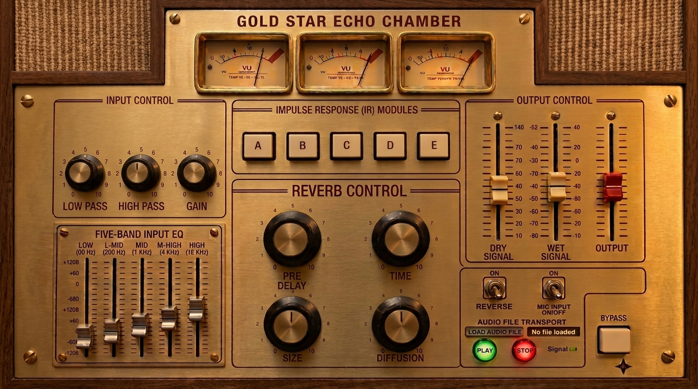

# GOLD STAR ECHO CHAMBER vAG40

A high-end convolution reverb plugin for macOS, built with real impulse responses from Gold Star Studios.



## Features

- **Partitioned Convolution** — FFT-based real-time convolution using Apple Accelerate (vDSP), with glitch-free IR hot-swapping
- **5 IR Slots (A–E)** — Load and switch between impulse responses instantly
- **5-Band Parametric EQ** — Low shelf (100 Hz), peaking (250 Hz, 1 kHz, 4 kHz), high shelf (10 kHz)
- **High Pass / Low Pass Filters** — Shape the input before convolution
- **Input Gain Control** — -80 dB to +12 dB range
- **Pre-Delay** — 0–500 ms with smooth interpolation
- **Room Size** — Scales the effective IR length dynamically
- **Diffusion** — Time-domain smearing for density control
- **Damping** — Progressive high-frequency rolloff on the IR tail
- **Reverse** — Flip the impulse response for reverse reverbs
- **Reverb Length (Time)** — Truncate or extend IRs with synthetic tail generation
- **Separate Dry/Wet Level Faders** — Independent control (dB-scaled)
- **Master Output Fader** — With red handle for visibility
- **3 VU Meters** — Input, processed signal, and output with animated needles (30 fps)
- **Live Microphone Input** — With hardware device selection and aggregate device support
- **Audio File Transport** — Load and play WAV/MP3/AIFF/M4A/FLAC files through the reverb
- **Bypass** — Smooth crossfade bypass with visual feedback
- **Menu Bar Integration** — Gold star status bar icon with IR selection, bypass toggle, and window management

## Requirements

- **macOS 12.0+** (Monterey or later)
- **Xcode Command Line Tools** (`xcode-select --install`)
- Apple Silicon or Intel Mac

## Build

```bash
make clean && make
```

The binary is output to `build/GoldStarEchoChamber`.

## Run

```bash
make run
```

Or run the binary directly:
```bash
./build/GoldStarEchoChamber
```

## Project Structure

```
src/
├── audio/
│   ├── audio_engine.cpp/h   # Main signal chain: gain → filters → EQ → pre-delay → convolution → mix
│   ├── biquad.h             # Real-time safe biquad filter (Direct Form II Transposed)
│   ├── convolver.cpp/h      # Partitioned FFT convolution via Apple Accelerate
│   ├── dsp_utils.h          # dB/linear conversion, sample/time utilities
│   ├── ir_loader.cpp/h      # WAV file loading, resampling, normalization
│   └── parameters.cpp/h     # Thread-safe parameter management with atomics
├── common/
│   └── version.h            # Version constants
└── standalone/
    ├── audio_io.cpp/h       # CoreAudio HAL I/O with aggregate device support
    ├── file_player.cpp/h    # Real-time safe audio file playback
    ├── main.mm              # Application entry point
    ├── standalone_app.cpp/h # Application coordinator
    ├── standalone_ui.h      # UI controller interface
    └── standalone_ui.mm     # Cocoa UI with overlay controls mapped to GUI image
resources/
├── gui/mockv30.jpeg         # GUI background image (1376×768)
├── ir_samples/              # Impulse response WAV files
├── Info.plist               # macOS application metadata
├── statusbar_icon.png       # Menu bar icon
└── statusbar_icon@2x.png   # Retina menu bar icon
```

## Architecture

- **Audio Thread Safety**: The convolver uses `try_lock` to avoid blocking the audio thread during IR updates. All parameters are stored in atomics for lock-free reading.
- **Partitioned Convolution**: IRs are split into fixed-size partitions and processed via overlap-add FFT convolution, enabling real-time processing of arbitrarily long impulse responses.
- **IR Rebuilding Pipeline**: When Room Size, Diffusion, Damping, or Reverse parameters change, the IR is rebuilt in a pipeline: size scaling → diffusion smearing → damping filter → reversal → length adjustment.

## Frameworks

| Framework | Purpose |
|---|---|
| Accelerate | FFT-based convolution (vDSP) |
| CoreAudio | Hardware audio I/O |
| AudioToolbox | Audio Unit hosting |
| Cocoa | Native macOS GUI |
| QuartzCore | Layer-backed views |
| UniformTypeIdentifiers | File type handling |
| AVFoundation | Audio session management |

## License

Copyright © Gold Star Studios. All rights reserved.

## Credits

Developed by Gold Star Studios.
